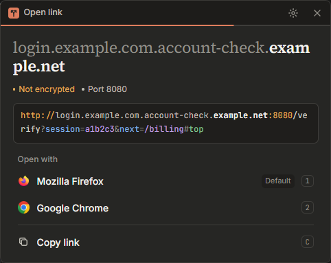

<div align="center">


# linkgate

**A link picker for WSL. Choose which Windows browser opens a link, and see where it really goes first.**

[](LICENCE)
[](https://github.com/zachlagden/linkgate/stargazers)
[](https://github.com/zachlagden/linkgate/commits/main)
[](https://github.com/zachlagden/linkgate/issues)
[](https://github.com/zachlagden/linkgate/actions/workflows/ci.yml)


[Install](#install) · [Use it from VS Code](#use-it-from-vs-code) · [How it works](#how-it-works) · [Report Bug](https://github.com/zachlagden/linkgate/issues) · [Request Feature](https://github.com/zachlagden/linkgate/issues)



</div>

---

## What is linkgate?

When a program in WSL runs `xdg-open https://...`, it normally opens a browser without asking. linkgate sits in that path. A small window appears in the middle of the monitor your mouse is on, shows the link broken into its parts, and offers every Windows browser you have installed plus "Copy link". Pressing a button runs that action and closes the window. After 10 seconds with no choice, the window closes and nothing happens.

It also opens PDFs and images from WSL. `xdg-open ~/report.pdf` turns the Linux path into the Windows one (`file://wsl.localhost/Ubuntu/home/...`) and passes it to the browser you pick.

It is a Tauri 2 app. The Rust side handles parsing, blocklist lookups, browser detection and launching. The window is React and Tailwind.

---

## Features

| Feature | Description |
| --- | --- |
| Browser choice | Lists every browser registered under `StartMenuInternet` in the Windows registry, with its icon, and marks your default. Hide the ones you don't want in settings. |
| Link anatomy | Shows the registrable domain large and the subdomain dimmed, so `paypal.com.account-check.io` reads as `account-check.io`. The full link is coloured by part: scheme, subdomain, domain, port, path, query keys, query values and fragment. |
| Warnings | Flags plain `http`, text before an `@` (which is not the site), punycode domains that imitate other letters, raw IP addresses and unusual ports. |
| Blocklist check | Checks the domain and its parent domains against the malicious, suspicious and tracking lists from [Pi-hole Optimized Blocklists](https://github.com/zachlagden/Pi-hole-Optimized-Blocklists). A match adds a confirmation step and never blocks the link. A switch in settings turns the check off. |
| Files from WSL | Converts WSL paths and `file://` links to Windows links for PDF, PNG, JPEG, GIF, WebP and SVG files. |
| Keyboard first | `1` to `9` open in a browser, `C` copies the link, `Esc` closes. |
| Private | Links are never logged. The only network traffic is the blocklist download, which you can turn off. |

---

## Install

### Requirements

- Windows 11 with WebView2, and WSL with interop enabled. `[interop] enabled` must not be `false` in `/etc/wsl.conf`. `appendWindowsPath = false` is fine, because the handler starts `linkgate.exe` by its full path.
- Rust with the `x86_64-pc-windows-msvc` target, `cargo-xwin`, `clang`, `lld` and `llvm`.
- Node 22 and pnpm.

```bash
rustup target add x86_64-pc-windows-msvc
cargo install --locked cargo-xwin
sudo apt install clang lld llvm
```

`cargo-xwin` downloads the MSVC CRT and Windows SDK on first use, which means accepting Microsoft's licence for them.

### Build and install

```bash
git clone https://github.com/zachlagden/linkgate.git
cd linkgate
pnpm install
pnpm install:windows
```

This builds `linkgate.exe`, copies it to `%LOCALAPPDATA%\Programs\linkgate`, installs `~/.local/bin/linkgate-open` and a `linkgate.desktop` handler, and sets that handler as the default for `http`, `https`, `text/html`, `application/pdf` and the common image types. It then downloads the blocklists.

Two settings are left to you, because they change files outside the project:

```bash
echo 'export BROWSER="$HOME/.local/bin/linkgate-open"' >> ~/.zshenv
sudo update-alternatives --install /usr/bin/x-www-browser x-www-browser "$HOME/.local/bin/linkgate-open" 500
```

Test it:

```bash
xdg-open https://example.com
```

`scripts/install.sh --skip-build` reinstalls the last build without rebuilding.

### Uninstall

```bash
rm -rf "/mnt/c/Users/<you>/AppData/Local/Programs/linkgate" "/mnt/c/Users/<you>/AppData/Local/linkgate" "/mnt/c/Users/<you>/AppData/Roaming/linkgate"
rm -f ~/.local/bin/linkgate-open ~/.local/share/applications/linkgate.desktop
```

Then remove the `BROWSER` line from your shell profile and, if you added it, the `x-www-browser` alternative with `sudo update-alternatives --remove x-www-browser "$HOME/.local/bin/linkgate-open"`. Pick a new default for the file types with `xdg-mime default <app>.desktop x-scheme-handler/https`.

---

## Use it from VS Code

VS Code for Windows opens links without going through WSL, so it needs two settings in its own `settings.json` (`Ctrl+Shift+P`, then `Preferences: Open User Settings (JSON)`):

```json
{
  "workbench.externalBrowser": "C:\\Users\\<you>\\AppData\\Local\\Programs\\linkgate\\linkgate.exe",
  "workbench.browser.openLocalhostLinks": false
}
```

- `workbench.externalBrowser` makes VS Code start `linkgate.exe` with the URL for every `http` and `https` link, whether it comes from the editor, the terminal or an extension.
- `workbench.browser.openLocalhostLinks` stops VS Code opening `localhost`, `127.0.0.1` and `0.0.0.0` links in its Integrated Browser. Without it, those links skip linkgate.

Replace `<you>` with your Windows user name, and use double backslashes because the file is JSON. Reload the window afterwards with `Ctrl+Shift+P`, then `Developer: Reload Window`.

---

## Usage

| Key | Action |
|---|---|
| `1` to `9` | Open in that browser |
| `C` | Copy the link |
| `Esc` | Close, or go back from a confirmation or settings |
| `Enter` | Confirm, on the blocklist confirmation |

Run `linkgate.exe` with no link, or click the gear in the title bar, to open settings. There you choose which browsers appear, turn the blocklist check on or off, and check the blocklists by hand.

### Warnings

| Warning | Meaning |
| --- | --- |
| Not encrypted | The link uses `http`, so anyone on the network can read or change the page. |
| Credentials | Text before an `@` is a username, not the site. `https://paypal.com@evil.example` goes to `evil.example`. |
| Punycode | The domain contains letters from another alphabet that can look like Latin ones. The window shows the decoded form. |
| IP address | The link goes to a raw IP address instead of a domain name. |
| Port | The link uses a port other than the scheme's default. |

---

## How it works

```
program in WSL
  │  xdg-open / $BROWSER / x-www-browser
  ▼
~/.local/bin/linkgate-open          (linux/linkgate-open)
  │  converts WSL paths to Windows links
  ▼
linkgate.exe <url>                  (through WSL interop)
  │  parses the link, checks the blocklists, reads browsers from the registry
  ▼
picker window on the monitor under the cursor
  │  you choose
  ▼
browser.exe <url>                   (or the clipboard)
```

`linkgate-open` is a shell script. It checks that WSL interop is on, converts an existing path or `file://` link to the Windows form, and starts `linkgate.exe` detached so the calling program doesn't wait for your choice.

Firefox reads a WSL file only as `file://///wsl.localhost/<distro>/...`, with five slashes, and shows a blank page for the standard two-slash form. linkgate shows the standard form in the window and converts it to the five-slash form when it starts any browser. Chrome opens that form too.

### Blocklists

Blocklists are downloaded to `%LOCALAPPDATA%\linkgate\lists` and converted to a sorted index that is memory-mapped and binary-searched, so a lookup doesn't load the 2 million domain list into memory. When linkgate starts and the last check is more than 24 hours old, it starts a detached `linkgate.exe --update-lists` process that fetches only the lists whose ETag changed.

Turn off "Check links against the blocklists" in settings and linkgate stops looking links up and stops downloading lists, so it makes no network requests. The lists already on disk stay there, and the check resumes when you turn the switch back on.

### Where files live

| Path | Contents |
| --- | --- |
| `%LOCALAPPDATA%\Programs\linkgate\linkgate.exe` | The app |
| `%APPDATA%\linkgate\settings.json` | Hidden browsers and the blocklist switch |
| `%LOCALAPPDATA%\linkgate\lists\` | Blocklists and their index |
| `%LOCALAPPDATA%\linkgate\icons\` | Cached browser icons |
| `%LOCALAPPDATA%\linkgate\linkgate.log` | Errors as JSON lines. Links are never logged. |
| `~/.local/bin/linkgate-open` | The WSL handler |
| `~/.local/share/applications/linkgate.desktop` | The desktop entry that registers it |

---

## Tech Stack

| Layer | Technology |
| --- | --- |
| App shell | Tauri 2 |
| Backend | Rust, `url`, `idna`, `psl`, `memmap2`, `winreg`, `ureq` |
| Frontend | React 19, TypeScript, Tailwind CSS 4, Vite |
| WSL handler | Bash |
| Cross-compiling | `cargo-xwin` from WSL, native MSVC on CI |

---

## Project Structure

```
src-tauri/src/
├── main.rs         # entry point, --update-lists mode
├── commands.rs     # commands the window calls
├── link.rs         # link parsing, domain split and warning signals
├── browsers.rs     # registry detection and launching
├── icons.rs        # browser icon extraction
├── lists/          # blocklist download, index and lookup
├── placement.rs    # window placement on the monitor under the cursor
├── settings.rs     # settings.json
├── paths.rs        # data and config directories
└── logging.rs      # JSON-lines error log
src/                # React frontend: picker, link anatomy, confirmation, settings
linux/              # linkgate-open and the desktop entry
scripts/            # install.sh and the Rust test runner
```

---

## Development

| Command | What it does |
|---|---|
| `pnpm dev` | Runs the Vite dev server for the frontend alone |
| `pnpm build` | Type-checks and builds the frontend into `dist/` |
| `pnpm build:windows` | Builds `linkgate.exe` with `cargo-xwin` |
| `pnpm test:rust` | Builds the Rust tests for Windows and runs them through interop |
| `pnpm install:windows` | Builds and installs, as above |

See [CONTRIBUTING.md](CONTRIBUTING.md) for the pull request process.

---

## Troubleshooting

<details>
<summary>"WSL interop is disabled" or "linkgate.exe is missing"</summary>

`linkgate-open` prints one of these when it can't start the Windows app. For the first, check that `/etc/wsl.conf` doesn't set `[interop] enabled=false`, then run `wsl --shutdown` from Windows. For the second, run `scripts/install.sh` again.
</details>

<details>
<summary>A program still opens links without the picker</summary>

Check which handler `xdg-open` uses with `xdg-mime query default x-scheme-handler/https`. It should print `linkgate.desktop`. Programs that read `$BROWSER` need the export from the install step. Programs that run on Windows, such as VS Code, need their own setting.
</details>

<details>
<summary>Firefox shows a blank page for a file</summary>

Firefox reads WSL files only as `file://///wsl.localhost/<distro>/...`. linkgate converts to that form when it starts a browser, so a blank page means the build is older than that fix. Reinstall with `pnpm install:windows`.
</details>

<details>
<summary>The blocklists are out of date</summary>

Open settings and check the lists by hand. The log at `%LOCALAPPDATA%\linkgate\linkgate.log` records download errors.
</details>

---

## Star History

<a href="https://github.com/zachlagden/linkgate/stargazers">
 <picture>
   <source media="(prefers-color-scheme: dark)" srcset="https://repo-star-history.zachlagden.uk/svg?repos=zachlagden/linkgate&type=Date&theme=dark&legend=top-left&format=png" />
   <source media="(prefers-color-scheme: light)" srcset="https://repo-star-history.zachlagden.uk/svg?repos=zachlagden/linkgate&type=Date&legend=top-left&format=png" />
   
 </picture>
</a>

---

## Support

If this project is useful to you, consider supporting development:

<a href="https://github.com/sponsors/zachlagden">
  
</a>

---

## License

This project is licensed under the MIT License. See the [LICENCE](LICENCE) file for details.

---

<div align="center">

**[Report Bug](https://github.com/zachlagden/linkgate/issues)** · **[Request Feature](https://github.com/zachlagden/linkgate/issues)**

Made by [Zach Lagden](https://github.com/zachlagden)

</div>
